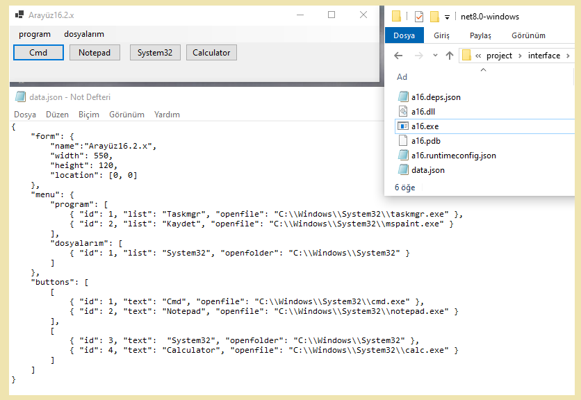

# 📂 interface

> [!TIP]
> ✨Bu program ile kendi butonlu menünüzü data.json dosyası üzerinden yazabilirsiniz.<br/>→Program şurada -> [_**bin\Debug\net8.0-windows\a16.exe**_](https://github.com/levham/interface/blob/main/bin/Debug/net8.0-windows/a16.exe). 

> [!NOTE]
> data.json içeriğini değiştirdikten sonra a16.exe'yi çalştırabilirsiniz.<br>Json dosyası içeriğini dikkatli yazın.
 

### 📂 button.json
| ✨ Parametre | 📌 Açıklama|
|---------------|-------------------|
| _**form**_      | _pencere hakkında_|
| `name: "program"`       | _pencere adı_|
| `width: 500`       | _pencere genişliği_|
| `height: 120`      | _pencere yüksekliği_|
|`location:[0, 0]`     | _pencere konumu_|
| _**menu**_  | _menuler_|
| _list_    | _menuler için seçenekler_|
| _openfile_    | _dosya çalıştır_|
| _openfilemin_    | _minimum olarak dosya çalıştır_|
| _openfolder_    | _klasör çalıştır_|
| _**buttons**_  | _butonlar_|
| _text_    | _butonlar için seçenekler_|
| _openfile_    | _dosya çalıştır_|
| _openfilemin_    | _minimum olarak dosya çalıştır_|
| _openfolder_    | _klasör çalıştır_|
<br>
<br>

> [!TIP]
>  "openfile": "C:\\Windows\\System32\\notepad.exe" , "args":"abc"   bu komut ile programı parametreli çalıştırmış olursun.
<br>
<br>

> [!TIP]
>  ✨✨<ins>**Örnek data.json**</ins> 

``` 
{
    "form": {
        "name":"Arayüz16.3.x",
        "width": 550,
        "height":140,
        "location": [-8, -10],
	    "buttonsize":"auto",
	    "alwaysontop":true,
	    "brightness":80
    },
    "menu": {
    "control":["alwaysontop","#b7d0bc","#fae5d3"],
        "program": [
            { "list": "Taskmgr"  , "openfile": "C:\\Windows\\System32\\taskmgr.exe" },
            { "list": "Kaydet"   , "openfilemin": "C:\\Windows\\System32\\mspaint.exe" }
        ],
        "dosyalarım": [
            { "list": "System32" , "openfolder": "C:\\Windows\\System32" }
        ]
    },
    "buttons": [
        [
            { "text": "Cmd"       , "openfile": "C:\\Windows\\System32\\cmd.exe" }, 
            { "text": "Paint"     , "openfile": "C:\\Windows\\System32\\mspaint.exe" }, 
            { "text": "Notepad"   , "openfile": "C:\\Windows\\System32\\notepad.exe" },
            { "text": "Notepad2"  , "openfile": "C:\\Windows\\System32\\notepad.exe" , "args":"abc" }
        ],
        [
            { "text":  "System32" , "openfolder": "C:\\Windows\\System32" },
            { "text": "Calculator", "openfile": "C:\\Windows\\System32\\calc.exe" }
        ]
    ] 
} 
```
<br>

> [!NOTE]
> 📌**Programın Çalışma Örneği**


<br>
---
<br>
<br>
