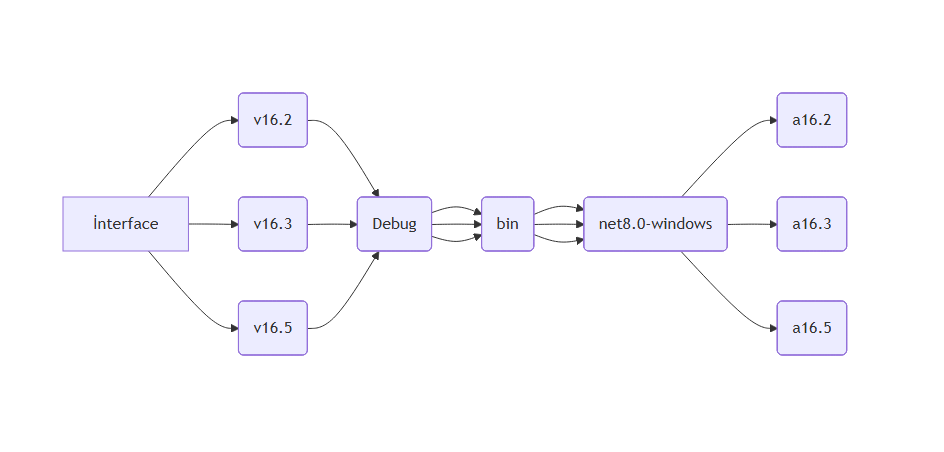

# 📂 interface

> [!WARNING]
> ✨Bu program Windows platformunda çalşmaktadır<br/>✨Kendi butonlu menünüzü data.json dosyası üzerinden yazabilirsiniz.





> #Programın diğer sürümleri
> [_**v16.2\bin\Debug\net8.0-windows\a16.2.exe**_](https://github.com/levham/interface/blob/main/v16.2/bin/Debug/net8.0-windows/a16.2.exe)<br> [_**v16.3\bin\Debug\net8.0-windows\a16.3.exe**_](https://github.com/levham/interface/blob/main/v16.3/bin/Debug/net8.0-windows/a16.3.exe)<br> [_**v16.5\bin\Debug\net8.0-windows\a16.5.exe**_](https://github.com/levham/interface/blob/main/v16.5/bin/Debug/net8.0-windows/a16.5.exe)


> [!TIP]
> ✨v16.2.exe için → button.json <br/>✨v16.3.exe ve v16.5 için → data.json <br/>→ dosyaları ile menünüzü yazabilirsiniz.
  
### 📂v16.5 için data.json özellikleri
| ✨ Parametre | 📌 Açıklama|
|---------------|-------------------|
| _**settings**_      | _pencere hakkında_| 
| `"width": 500`       | _pencere genişliği_|
| `"height": 120`      | _pencere yüksekliği_|
|`"location":[0, 0]`     | _pencere ekranda konumu x y_|
|`"buttonsize":"20"` | _butonların uzunluğu_ |
|`"alwaysontop":true` | _pencere ön planda mı_|
|`"brightness":90` | _pencere parlaklığı_|
| _**menu**_  | _menuler_|
| _list_    | _menuler için alt seçenekleri açar_|
| _openfile_    | _dosya çalıştır_|
| _openfilemin_    | _minimum olarak dosya çalıştır_|
| _openfolder_    | _klasör çalıştırır_|

<br>

> [!TIP]
>  ✨✨<ins>**v16.5 için data.json**</ins> 

``` 
{ 
  "settings": {
    "width": 30,
    "height": 200,
    "location": [0, 0],
    "brightness": 90,
    "alwaysontop": true,
    "buttonsize":20 
  },
  "menu": [
    {
      "title": "Dosya",
      "items": [
       { "list":  "System32" , "openfolder": "C:\\Windows\\System32" },
       { "list":  "Program Files" , "openfolder": "C:\\Program Files" },
      ]
    },
    {
      "title": "Program",
      "items": [
       { "list": "Cmd"      ,"openfile": "C:\\Windows\\System32\\cmd.exe" },
       { "list": "Taskmgr"  ,"openfilemin": "C:\\Windows\\System32\\taskmgr.exe" },
      ]
    },
  ]
}
``` 

> [!NOTE]
>  "openfile": "C:\\Windows\\System32\\notepad.exe" , "args":"abc"   bu komut ile programa abc kelimesini göndermiş olursun 

> [!NOTE]
>  "openfilemin": "C:\\Windows\\System32\\notepad.exe" , "args":"abc"   bu komut ile programa abc kelimesini göndermiş olursun 

<br>
<br>
-----

### 📂v16.3 için button.json özellikleri
| ✨ Parametre | 📌 Açıklama|
|---------------|-------------------|
| _**form**_      | _pencere hakkında_|
| `name: "program"`       | _pencere adı_|
| `width: 500`       | _pencere genişliği_|
| `height: 120`      | _pencere yüksekliği_|
|`location:[0, 0]`     | _pencere konumu_|
|`buttonsize:20` | _butonların uzunluğu_ |
|`alwaysontop:true` | _pencere ön planda mı_|
|`brightness:90` | _pencere parlaklığı_|
| _**menu**_  | _menuler_|
| _list_    | _menuler için seçenekler_|
| _openfile_    | _dosya çalıştır_|
| _openfilemin_    | _minimum olarak dosya çalıştır_|
| _openfolder_    | _klasör çalıştır_|
| _**buttons**_  | _butonlar_|
| _text_    | _butonlar için seçenekler_|
| _openfile_    | _dosya çalıştır_|
| _openfilemin_    | _minimum olarak dosya çalıştır_|
| _openfolder_    | _klasör çalıştır_|

<br>

> [!TIP]
>  ✨✨<ins>**v16.3 için data.json**</ins> 

``` 
{
    "form": {
        "name":"Arayüz16.3.x",
        "width": 550,
        "height":140,
        "location": [-8, -10],
	    "buttonsize":"auto",
	    "alwaysontop":true,
	    "brightness":80
    },
    "menu": {
    "control":["alwaysontop","#b7d0bc","#fae5d3"],
        "program": [
            { "list": "Taskmgr"  , "openfile": "C:\\Windows\\System32\\taskmgr.exe" },
            { "list": "Notepad"   , "openfilemin": "C:\\Windows\\System32\\mspaint.exe" }
        ],
        "dosyalarım": [
            { "list": "System32" , "openfolder": "C:\\Windows\\System32" }
        ]
    },
    "buttons": [
        [
            { "text": "Cmd"       , "openfile": "C:\\Windows\\System32\\cmd.exe" }, 
            { "text": "Paint"     , "openfile": "C:\\Windows\\System32\\mspaint.exe" }, 
            { "text": "Notepad"   , "openfile": "C:\\Windows\\System32\\notepad.exe" },
            { "text": "Notepad2"  , "openfile": "C:\\Windows\\System32\\notepad.exe" , "args":"abc" }
        ],
        [
            { "text":  "System32" , "openfolder": "C:\\Windows\\System32" },
            { "text": "Calculator", "openfile": "C:\\Windows\\System32\\calc.exe" }
        ]
    ] 
} 
```

> [!NOTE]
>  "openfile": "C:\\Windows\\System32\\notepad.exe" , "args":"abc"   bu komut ile programa abc kelimesini göndermiş olursun 

> [!NOTE]
>  "openfilemin": "C:\\Windows\\System32\\notepad.exe" , "args":"abc"   bu komut ile programa abc kelimesini göndermiş olursun 
<br>
<br> 
